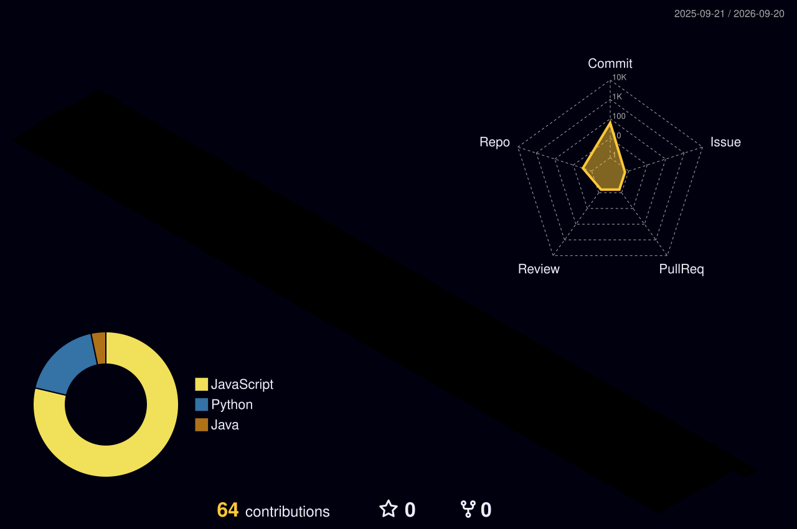

<!--
╔══════════════════════════════════════════════════════════════════════════╗
║  Matheus Henrique · Profile README (English)                             ║
║  Portuguese version: README.md — keep both in sync.                      ║
║  Assets in ./assets are hand-built SVGs (pure SMIL, no JS).              ║
╚══════════════════════════════════════════════════════════════════════════╝
-->

<!-- ╭─────────────────────────── HERO ───────────────────────────╮ -->

  

<!-- ╭──────────────────────── LANGUAGE ──────────────────────────╮ -->

  
  

  
  
  
  

 

<!-- ╭──────────────────────── WHOAMI ────────────────────────────╮ -->
<h2 align="center">&#9679; whoami</h2>

  

 

<!-- ╭───────────────────────── NOW ──────────────────────────────╮
     EDIT THIS SECTION. Keep it in sync with the pt-BR version.           -->
<h2 align="center">&#9679; right now</h2>

**Developer** and **Systems Analyst**.  
**BSc in Computer Science**, currently taking a **postgrad in Artificial Intelligence**.  
Building APIs with **Java / Spring Boot** and **Node / NestJS**.

**Open to back-end opportunities** — remote or hybrid.  
Best way to reach me: [email](mailto:matheushenriqueds1223@gmail.com) or [LinkedIn](https://www.linkedin.com/in/matheus-henriquedev/).

 

<!-- ╭──────────────────────────── STACK ─────────────────────────╮ -->
<h2 align="center">&#9679; stack</h2>

<table align="center" width="100%">
<tr>
<td width="46%" align="center" valign="middle">

</td>
<td width="54%" align="center" valign="middle">

**Back-end & languages**

**Data & persistence**

**Infra & DevOps**

**Front & tooling**

 

`Hexagonal` &nbsp;`DDD` &nbsp;`SOLID` &nbsp;`TDD` &nbsp;`REST` &nbsp;`GraphQL` &nbsp;`OpenAPI` &nbsp;`CI/CD`

</td>
</tr>
</table>

  

 

<!-- ╭─────────────────────── HOW I WORK ─────────────────────────╮ -->
<h2 align="center">&#9679; how I build a back-end</h2>

  

|  | what I do | why |
|:--:|:--|:--|
| **01** | Keep business rules free of HTTP and ORM | swapping framework or database shouldn't mean rewriting the domain |
| **02** | Timeouts, retry with backoff and circuit breakers from day one | the external call *will* fail; the question is how the system reacts |
| **03** | Structured logs and metrics before the deploy | without them, debugging production is guesswork |
| **04** | Decide invalidation before writing the cache | a cache with no invalidation plan becomes a silent bug |
| **05** | Unit tests for logic, integration tests at the edges | that's where the real failures live: database, queue, third-party API |

 

<!-- ╭──────────────────────────── STATS ─────────────────────────╮ -->
<h2 align="center">&#9679; metrics</h2>

  
  

  

  

  

 

<!-- ╭───────────────────── 3D CONTRIBUTIONS ─────────────────────╮ -->
<h2 align="center">&#9679; 3D contributions</h2>

  

 

<!-- ╭──────────────────────────── SNAKE ─────────────────────────╮ -->
<h2 align="center">&#9679; contribution snake</h2>

  <picture>
    <source media="(prefers-color-scheme: dark)"  srcset="https://raw.githubusercontent.com/Matheush2ds/MatheusH2ds/output/github-snake-dark.svg"/>
    <source media="(prefers-color-scheme: light)" srcset="https://raw.githubusercontent.com/Matheush2ds/MatheusH2ds/output/github-snake.svg"/>
    
  </picture>

 

<!-- ╭──────────────────────────── FOOTER ────────────────────────╮ -->

  <a href="mailto:matheushenriqueds1223@gmail.com">matheushenriqueds1223@gmail.com</a>
  &nbsp;·&nbsp;
  <a href="https://www.linkedin.com/in/matheus-henriquedev/">LinkedIn</a>

