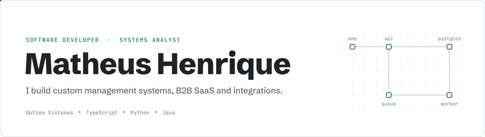

<picture>
  <source media="(prefers-color-scheme: dark)" srcset="./assets/hero-dark.en.svg">
  <source media="(prefers-color-scheme: light)" srcset="./assets/hero-light.en.svg">
  
</picture>

  <a href="https://optimasistemas.com">optimasistemas.com</a>
  &nbsp;·&nbsp;
  <a href="https://www.linkedin.com/in/matheus-henriquedev/">LinkedIn</a>
  &nbsp;·&nbsp;
  <a href="mailto:matheushenriqueds1223@gmail.com">matheushenriqueds1223@gmail.com</a>
  &nbsp;·&nbsp;
  <a href="./README.md">Português</a>

 

## About

I'm a developer at **Optima Sistemas**, where I build custom management software for service companies, and a **Systems Analyst**. I work from the database to the interface, with a focus on the back end: data modeling, business rules, integrations and running systems in production.

B.Sc. in Computer Science, currently doing a postgraduate program in Artificial Intelligence.

## Selected work

Products I build and maintain at Optima. The code is private; I'm happy to walk through the architecture and technical decisions in a call.

### Optima Control
Management SaaS for pest control companies: work orders, inventory, payables and receivables, integrated billing and PDF certificates with digital signature.

`Next.js` `Prisma` `PostgreSQL` `Playwright` `GitHub Actions` `Railway`

### Portal SST
Occupational safety in two modules, PPE delivery with digital signature and psychosocial risk assessment (Brazil's NR-1), behind an API gateway with single sign-on.

`Node.js` `FastAPI` `Prisma` `PostgreSQL` `Turborepo`

### Vacation rental ERP
Operations for short-term rentals: bookings, linen kit assembly, stockroom, cleaning orders and owner payouts, integrated with the PMS and Google.

`Node.js` `Express` `PostgreSQL` `React`

## How I build software

| Principle | In practice |
|:--|:--|
| Business rules outside the framework | Use cases isolated from HTTP and the ORM; changing an edge doesn't rewrite the domain. |
| Each customer's data isolated in the database | Row Level Security in PostgreSQL, checked in CI before every deploy. |
| Versioned schema | Every database change is a reviewable migration. No automatic schema sync in production. |
| A backup only counts if it restores | Scheduled backups and an automated restore drill. |
| Test where errors show up | Unit tests for business rules, integration and E2E at the edges: database, queue and third-party APIs. |
| Observable from day one | Structured logs and error tracking set up before the first deploy. |

## Stack

<table>
  <tr>
    <td width="150"><b>Main</b></td>
    <td></td>
  </tr>
  <tr>
    <td><b>Also</b></td>
    <td></td>
  </tr>
  <tr>
    <td><b>Data</b></td>
    <td></td>
  </tr>
  <tr>
    <td><b>Infra</b></td>
    <td></td>
  </tr>
</table>

## Contact

For custom projects, reach Optima at [optimasistemas.com](https://optimasistemas.com). For anything else, [LinkedIn](https://www.linkedin.com/in/matheus-henriquedev/) or [email](mailto:matheushenriqueds1223@gmail.com).
