<!--
╔══════════════════════════════════════════════════════════════════════════╗
║  Matheus Henrique · Profile README                                       ║
║  As peças animadas em ./assets são SVGs custom (SMIL puro, sem JS).      ║
║  Regenere com: python3 tools/gen_hero.py etc.                            ║
╚══════════════════════════════════════════════════════════════════════════╝
-->

<!-- ╭─────────────────────────── HERO ───────────────────────────╮ -->

  

  

  
  
  
  
  

 

<!-- ╭──────────────────────── SOBRE MIM ─────────────────────────╮ -->
<h2 align="center">&#9679; whoami</h2>

  

 

<!-- ╭──────────────────────────── STACK ─────────────────────────╮ -->
<h2 align="center">&#9679; stack</h2>

<table align="center" width="100%">
<tr>
<td width="46%" align="center" valign="middle">

</td>
<td width="54%" align="center" valign="middle">

**Back-End & Linguagens**

**Dados & Persistência**

**Infra & DevOps**

**Front & Ferramentas**

 

`Hexagonal` &nbsp;`DDD` &nbsp;`SOLID` &nbsp;`TDD` &nbsp;`REST` &nbsp;`GraphQL` &nbsp;`OpenAPI` &nbsp;`CI/CD`

</td>
</tr>
</table>

  

 

<!-- ╭──────────────────── COMO EU PENSO ─────────────────────────╮ -->
<h2 align="center">&#9679; como eu penso um back-end</h2>

  

|  | princípio | na prática |
|:--:|:--|:--|
| **01** | Domínio no centro | regra de negócio não conhece HTTP nem ORM |
| **02** | Falha é esperada | timeout, retry com backoff, circuit breaker |
| **03** | Se não mede, não existe | log estruturado, métrica e trace desde o dia 1 |
| **04** | Cache é decisão, não gambiarra | invalidação pensada antes do `SET` |
| **05** | Teste é documentação executável | unitário rápido, integração onde dói |

 

<!-- ╭──────────────── CONTRIBUIÇÕES EM 3D ───────────────────────╮ -->
<h2 align="center">&#9679; contribuições em 3D</h2>

  <!-- gerado por .github/workflows/profile-3d.yml -->
  

 

<!-- ╭──────────────────────────── STATS ─────────────────────────╮ -->
<h2 align="center">&#9679; métricas</h2>

  
  

  

  

  

 

<!-- ╭──────────────────────────── SNAKE ─────────────────────────╮ -->
<h2 align="center">&#9679; contribution snake</h2>

  <!-- gerado por .github/workflows/snake.yml -->
  <picture>
    <source media="(prefers-color-scheme: dark)"  srcset="https://raw.githubusercontent.com/Matheush2ds/Matheush2ds/output/github-snake-dark.svg"/>
    <source media="(prefers-color-scheme: light)" srcset="https://raw.githubusercontent.com/Matheush2ds/Matheush2ds/output/github-snake.svg"/>
    
  </picture>

 

<!-- ╭──────────────────────────── FECHO ─────────────────────────╮ -->

  

  

