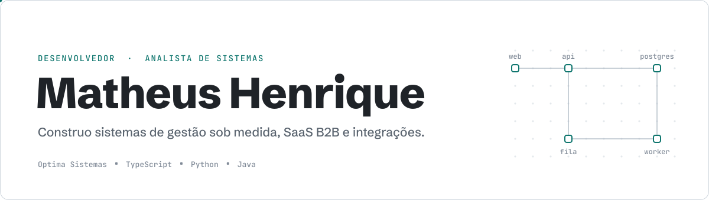
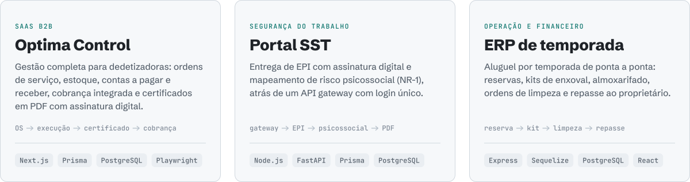
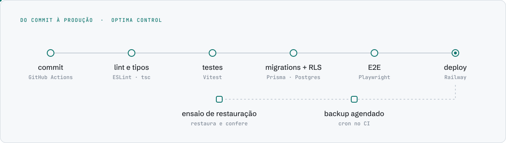

<picture>
  <source media="(prefers-color-scheme: dark)" srcset="./assets/hero-dark.svg">
  <source media="(prefers-color-scheme: light)" srcset="./assets/hero-light.svg">
  
</picture>

  <a href="https://optimasistemas.com">optimasistemas.com</a>
  &nbsp;·&nbsp;
  <a href="https://www.linkedin.com/in/matheus-henriquedev/">LinkedIn</a>
  &nbsp;·&nbsp;
  <a href="mailto:matheushenriqueds1223@gmail.com">matheushenriqueds1223@gmail.com</a>
  &nbsp;·&nbsp;
  <a href="./README.en.md">English</a>

 

## Sobre

Sou desenvolvedor na **Optima Sistemas**, onde construo software de gestão sob medida para empresas de serviço, e **Analista de Sistemas**. Trabalho do banco de dados à interface, com foco em back-end: modelagem, regras de negócio, integrações e operação em produção.

Bacharel em Ciência da Computação, cursando pós-graduação em Inteligência Artificial.

## Projetos selecionados

Produtos que desenvolvo e mantenho na Optima. O código é privado; apresento arquitetura e decisões técnicas numa conversa.

<picture>
  <source media="(prefers-color-scheme: dark)" srcset="./assets/projects-dark.svg">
  <source media="(prefers-color-scheme: light)" srcset="./assets/projects-light.svg">
  
</picture>

## Como eu construo software

<picture>
  <source media="(prefers-color-scheme: dark)" srcset="./assets/pipeline-dark.svg">
  <source media="(prefers-color-scheme: light)" srcset="./assets/pipeline-light.svg">
  
</picture>

 

| Princípio | Na prática |
|:--|:--|
| Regra de negócio fora do framework | Casos de uso isolados de HTTP e ORM; trocar a borda não reescreve o domínio. |
| Dados de cada cliente isolados no banco | Row Level Security no PostgreSQL, verificado no CI antes de cada deploy. |
| Schema versionado | Toda mudança de banco vira migration revisável. Nada de sincronização automática em produção. |
| Backup só conta se restaura | Backup agendado e ensaio de restauração automatizado. |
| Teste onde o erro aparece | Unitário para regra de negócio, integração e E2E nas bordas: banco, fila e API de terceiro. |
| Produção observável desde o início | Log estruturado e rastreamento de erros configurados antes do primeiro deploy. |

## Stack

<table>
  <tr>
    <td width="150"><b>Principal</b></td>
    <td></td>
  </tr>
  <tr>
    <td><b>Também uso</b></td>
    <td></td>
  </tr>
  <tr>
    <td><b>Dados</b></td>
    <td></td>
  </tr>
  <tr>
    <td><b>Infra</b></td>
    <td></td>
  </tr>
</table>

## Contato

Para projetos sob medida, fale com a Optima pelo [optimasistemas.com](https://optimasistemas.com). Para o resto, [LinkedIn](https://www.linkedin.com/in/matheus-henriquedev/) ou [e-mail](mailto:matheushenriqueds1223@gmail.com).
